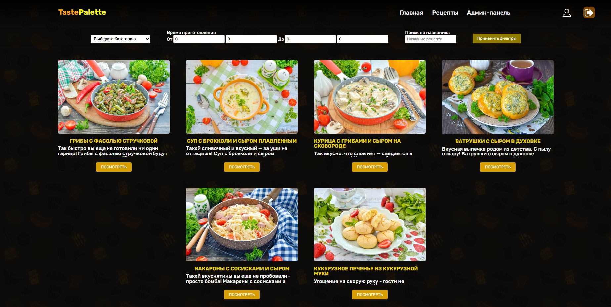
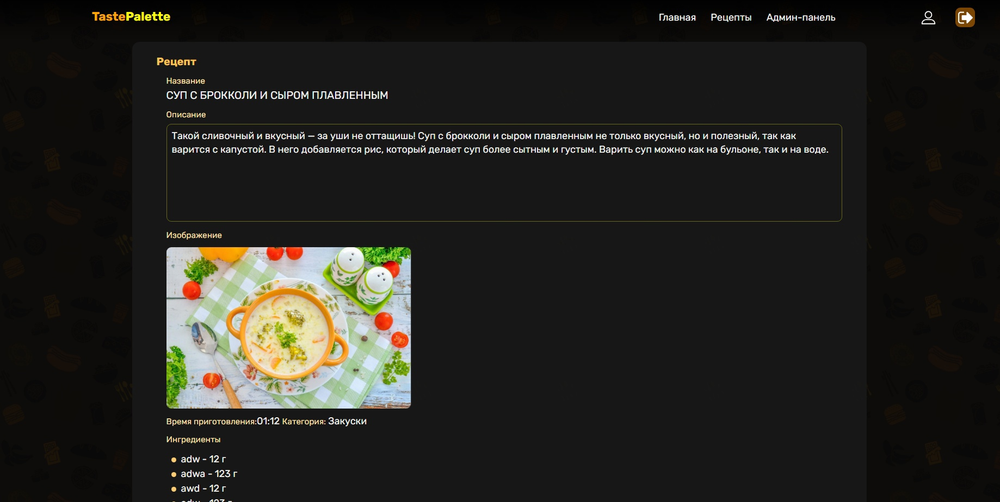
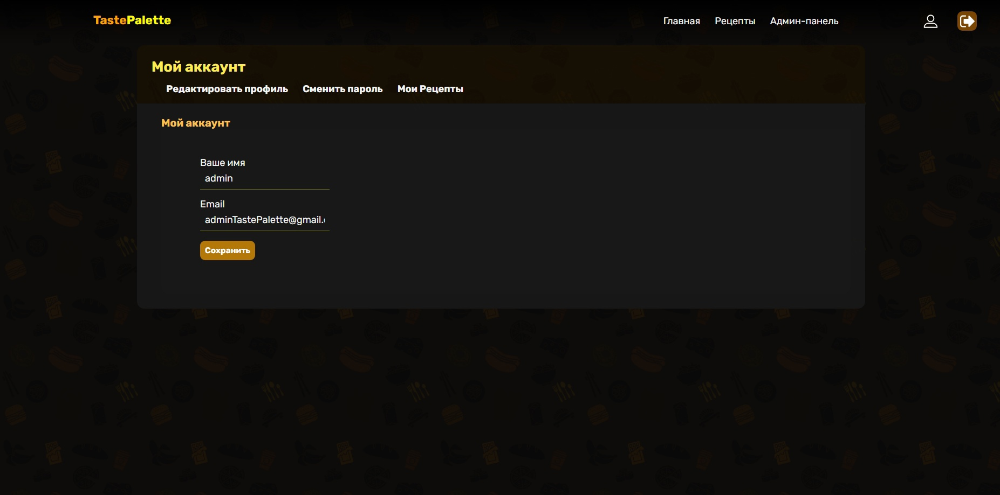
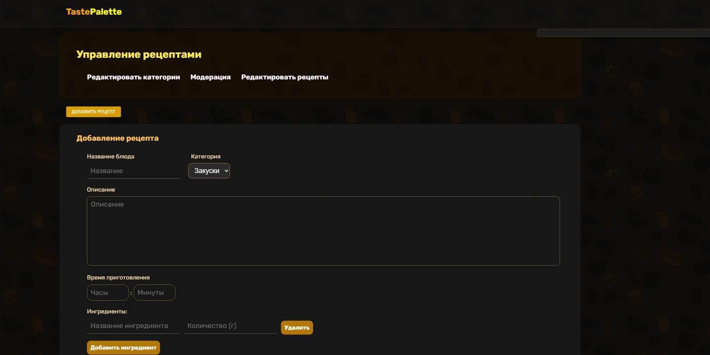

# 🍽️ Recipe Sharing Website 
## 📄 Description
This project is a PHP-based web application designed for sharing and discovering recipes. Users can browse a wide range of recipes, view detailed information about each dish, rate them, and explore similar recipes within the same category. The site ensures a user-friendly experience with a clear and responsive design.

## 🌟 Key Features
-   **Recipe Database:** Extensive collection of recipes with detailed descriptions, ingredients, and step-by-step instructions.

-   **Category Browsing:** Explore recipes by categories to easily find specific types of dishes.

-   **Ingredient Listing:** Each recipe includes a detailed list of ingredients with quantities for easy preparation.

-   **Step-by-Step Instructions:** Detailed cooking steps are provided to guide users through the preparation process.

-   **Responsive Design:** Optimized for both desktop and mobile devices, ensuring a seamless user experience.

## 🛠️ Technologies Used
-   **PHP:** Backend scripting language for dynamic content generation.

-   **MySQL:** Relational database management system for storing recipe data.

-   **HTML & CSS:** Markup and styling for structuring and designing the website.

-   **JavaScript & jQuery:** Client-side scripting for dynamic interactions and AJAX functionality.

## ⚙️ Installation
1.  **Clone the repository:**
```bash
    git clone https://github.com/yourusername/recipe-sharing-website.git
```

2. **Navigate to the project directory:**
```bash
    cd recipe-sharing-website
```

3. **Set up the database:**
    -   Ensure you have MySQL installed and running.

    -   Create a database and import the provided SQL schema.

    -   Update the database connection details in dbConnect.php.

4. **Deploy the website:**
    -   Use a local server (e.g., XAMPP, WAMP) or a remote server that supports PHP and MySQL.

5. **Open your browser and navigate to:**
```bash
    http://localhost/recipe-sharing-website
```

## 🚀 Usage
-   **Browse Recipes:** Explore various recipes, view detailed information, and find inspiration for your next meal.

-   **Discover by Category:** Easily find recipes in specific categories such as desserts, main courses, or appetizers.


## 💥 Appearance
### Login page


### Main page


### Recipes page


### Recipe info page


### Profile page


### Admin panel



## 🤝 Contributing
Pull requests are welcome. For major changes, please open an issue first to discuss what you would like to change.

